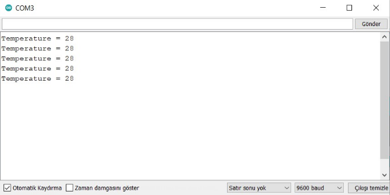

#  Gömülü Sistemlerde Haberleşme

Merhaba, bu yazımında sizlerle gömülü sistemlerde haberleşme nasıl yapılır ondan bahsedeceğim.

Öncellikle yazıya geçmeden önce sizlere geçen sene en çok sorun yaşadığım bu haberleşme konusunun neden önemli olduğundan bahsedeceğim. Bir inşaatta nasıl temel olmadan diğer katlara geçilemeyeceği gibi model uyduda da iletişim olmadan diğer işlemleri gerçekleştiremezsiniz. Eğer haberleşme düzgün kurulmuyorsa diğer yaptığınız tüm işlemler hiçbir işe yaramıyacaktır. Haberleşmede yaşayacağınız en ufak aksaklık haliyle arayüzünüzde sorunlara da yol açabilir. Bunların tedbirlerini almanız gerekmektedir. Ben sizlere haberleşme konusunda yaşadığım yazılımsal problemleri anlatacağım. Ancak sizlerinde bu hataları görüp nasıl çözüm bulunduğu görmeniz için öncelikle sorunu belirtip daha sonra sorunun çözümü göstereceğim. Bunlardan bazıları kendim yapmaya çalıştığım yöntemler olacaktır ve muhtemelen sizlerde ilk olarak bu yöntemlerden birini kulanacaksınız.
Evet hazırsak başlıyoruz…


## İçindekiler

- [Arayüz](#Arayüz)
- [Haberleşme](#Haberleşme)
  - [XML](#XML)
  - [JSON](#JSON)
  - [NanoPb](#NanoPb)


 ### Arayüz

Model Uydu için arayüz tasarlarken belli başlı adımları izlemeniz gerekiyor. Bu adımları ben kısaca şöyle adımlıyorum;

1. İlk olarak arayüzde istenilen isterlerin belirlenmesi.
2. Bu isterler üzerinden arayüzü tasarlamak.(Bakın ilk önce arayüzü tasarlayın hele ki tek kişi tasarlıyorsanız.)
3. Daha sonra arayüz az çok hazır olduktan sonra artık backend(lojik katman) kısmına geçebilirsiniz.
4. Backend kısmında ise uçuş yazılımınız büyük ihtimalle hala yazılmamıştır. Peki neye göre yazacam diyeceksinizdir. Burada ise tamamen sanki telemetri verisi iletilmiş ve siz bu veriyi okumuşsunuz gibi davranın. Ardından okunan verileri artık kullanılacak yerlere yerleştirin. Ancak veri transferi hakkında hiçbir şey bilmiyorsanız basit olarak bir kaç deneme yapabilirsiniz. 
5. Tamam artık şimdi veri transfer etmeye ve bu transfer edilen verinin okunması adımına geçtik.

Bu adımlar az çok her arayüz tasarımı için geçerli olacaktır.Hadi biraz detaya girelim ve bir arayüz tasarlayalım ve bu adımları üzerinde uygulayalım.


Şimdi yukarıdaki resimde arayüzü basit manada oluşturduk ve görüldüğü gibi çok fazla eksik var ve bu eksikleri tamamen isterler üzerinden giderek eklememiz gerekiyor. Ben 2020 yılı Türksat Model Uydu için istenen isterler üzerinden gideceğim. Arka plan kamerayı sağ alt köşedeki dikdörtgen ise haritayı teslim etmektedir. Gps ve oriantaion(yaw,pitch,roll), takım numarası, batary, tarih ve saat gibi bir kaç şey belirtilmiş fakat eksikleri daha sonra ekleyeceğiz. Gördüğünüz gibi arayüz oluşturuldu ama eksikler var. Zaten her şeyi bir anda tasarlayamayacağımız farkındayım ben de şuanlık böyle bırakıp artık backend kodlarına geçeceğim. Daha sonra eksik olan kısımları düzenleyeceğiz. Burada ise çok önemli kısım UI ile logic kısmı bir birinden ayırmanız bu size tasarımda oldukça esneklik sağlayacakır. Böyle bir tasarım yapmak için MVC design patern’ı araştırabilirsiniz.


Evet şimdi 3. adıma geçtik backend kodları yazmaya başlıyoruz. Backend kodu ile kastetmek istediğim logic katmandır. Kodları burda yazarak gitmek isterdim fakat o kadar bir vakit olmadığı için burayı tabiki siz yazacaksınız. Hadi 4. adımı inceleyelim. Teslim alınan telemetri verisini arayüzde bulunan yerlerine atama yapmanız gerekiyor. Bu telemetri verilerini nasıl teslim alınıyormuş gibi yapıyoruz ona bakalım. Bu yöntem aslında Test Driven Development(TTD) ile oldukça benzerdir. Mesela biz saat, tarih, batarya verisini aldık diyelim.


Yukarıda 3 tane kırmızı kutucuk var ve bu kutucuklar içerisine text ekleyebileceğimiz kutulardır. Bu kutuların içerisine örnek olması amacıyla veriler yazdım. Biz teslim aldığımız saat, tarih ve batarya verisini buralara atayacağız. Diğer kısımlarıda aynı şekilde yapıyoruz.

Evet 4. adımıda geçtik şimdi artık telemetri verilerini teslim alabiliriz. Buraya kadar herşey sadece basit bir temel oluşturmak içindi çünkü veriyi nasıl kullanacağımızı bilerek verileri teslim almak daha rahat ve performanslı kod yazmamıza yardımcı olur. şimdi artık asıl meselemize geçme vakti geldi.


### Haberleşme

İlk olarak haberleşme nasıl yapılır sorusuna cevap verelim. 

Cihaz ile hostu(örn. Bilgisayar) haberleştirmek için kullanılan birden fazla haberleşme çeşiti vardır. Bunlar Seri Haberleşme, Ethernet ve Bluetooth olabilir. Hadi biz seri haberleşem kullanalım. Peki seri haberleşme nasıl oluyor. Seri haberleşme klasik, bilgisayarın portu ile micro denetleyici arasında kulladığınız USB kablosu(genellikle RS232) ile yapılan haberleşmedir. Herkesin rahatlıkla temin edip, basit kodlama ve protatip üretmek amacıyla Arduino kullanılarak kodlama yapılacaktır. Mantık her ortam için geçerlidir.


Haberleşme türünü seçtik hadi öyleyse haberleşmeye geçelim.

İlk olarak Arduino’da kullanılan sağ üst köşede bulunan seri port ekranını herkes bilir. Bunun seri iletişim yaparak seri ekrana veriyi bastığını bilen kaç kişi var. Seri port ekranı debug işlemi yapmamızı sağlayan bir özellik. Peki bu arduino içerisinde çalışan kodu nasıl oluyorda bizim bilgisayar ortamında gözlemlememizi sağlıyor olabilir? Konunun sonunda haberleşeme ile ilgili kafanızda pek soru işareti kalmayacaktır.

Elimizde temperature verisi var ve biz bunu `Serial.println()` ile seri port ekranına 1sn’ de bir basıyor olalım. Bu bizim haberleşme de kullanacağımız ilk ve en basit yoldur.

```C++
const int temperature = 28;
void setup() {
  Serial.begin(9600);
}
void loop() {
  Serial.print("Temperature = ");
  Serial.println(temp);
  delay(1000);
} 
```

İlk haberleşmemizi gerçeleştirdik. Gördüğünüz gibi çok basit bir şekilde veriyi bilgisayar ortamına aktardık ve serial port ekranı aracılığı ile Temperature değerini gözlemledik. Peki işlem nasıl gerçekleşti. Tabi ki Arduino Ide’si biz seri ekranı açtığımız anda farkında olmadan veriyi arduinodan 9600 baudrate hızında bağlantı kurarak teslim aldı. Bizim yazacağımız arayüz bu mantıkla seri port ekranına benziyor demi? Bizde arayüzü tasarlarken seri porttan faydalanabiliriz.

O zaman seri port ekranını gözlemleyelim. Baudrate hızını ayarlamak için bir adet combo box var. Buradan Arduino ile bilgisayar ortamı arasındaki haberleşeme hızını seçiyoruz. Arduinoda yazdığımız haberleşme hızı Serial.begin(9600) ile aynı olmalıdır. Turuncu kutucuk "Yeni satır", "starı başı", "NL ve CR ile birlikte" olmak üzere monitordan arduinoya veri gönderirken satır sonuna eklenecek opsiyonları içerir.



> **Not:** Arduino Ide’si Java ile yazılmıştır.

Evet ilk örneğimizi yaptık ve ekranda değerimizi gözlemledik. Öncellikle tüm verilerimizi bu şekilde tasarladığımız arayüze gönderebiliz hadi bir kaç veri daha ekleyip nasıl bir işlem gerçekleşeceğini gözlemliyelim.

```C++
float temperature = 28;
float humidity = 50;
long timestamp = 12450;
void setup() {
  Serial.begin(9600);
}
void loop() {
  Serial.print(temperature);
  Serial.print(',’); 
  Serial.print(humidity);
  Serial.print(',’); 
  Serial.println(timestamp);
  delay(1000);
}
```

Farz edelim ki 3 veriyi sensörden okuduk ve arayüzde okumak için bilgisayar ortamına gönderdik. Hadi arayüze geçip bunları nasıl okuyacağımıza bakalım. Daha sonra bu örneğimizin eksilerini artıları belirleyip daha iyi hale nasıl getireceğimize bakalım.


Sizlere haberleşme yapılırken bir kaç problemden daha bahsetmek istiyorum. 

1. **Haberleşme** **sırasında** **veri** **kaybı** **yaşamak**.

   Veri kaybı olması durumunda ne olur tabiki gönderilen sıra bozulur istenilen uzunlukta bir array elde edilmez ve arrayın son adresine ulaşmaya çalışıldığında segmatation fault hatası almak kaçınılmaz olur. Buda program sonlandırır.

2. **Haberleşme** **sırasında** **herhangi** **bir** **bit** **değişmesi**.

   Bitin değişmesi progrmamın çalışmasına mani olmaz ancak verinin yanlış olacağı ve anlık değişimlerin olacabileceği özellikle grafik çizimlerinde saçma sapan artış azalışların gözlemlenmesine sonuç olacaktır.

3. **Aynı** **mesaj** **içinde** **farklı** **bilgiler** **göndermek**.

4. **Farklı** **platformlar** **arası** **veri** **akışı** **sağlamak**.

5. **Donanımdan** **bağımsızlaştırmak**.


Aslında bu problem size protokol(Json,XML,NanoPb..) kullanmak zorunda bırakıyor. Yine de protokollere geçmeden sizelere protokolerle geçiş esnasına kadar neden bu protokoller kullanmak zorunda kaldığımızı örnekler üzerinde göstereceğim. Tabi protocol kullanmak zorunda değilsiniz ama kullanmak istemiyorsanız tüm bu problemleri kendiniz çözmek zorunda kalacaksınız.

Ancak bunların hepsini kendiniz deneyerek gözlemlerseniz çok daha akılda kalıcı olacak ve daha iyi anlaşılacakdır.


Artık ilk örneğimizi geliştirme zamanı geldi.

`Serial.print()` yerine artık `Serial.write()` kullanalım.

Bunun sebebi Serial.print() text tabanlı(formatlı) akatarım yapmasına karşın Serial.write() binary tabanlı(formatsız) aktarım yapmasıdır buda bizlere çok daha performanslı işlem sağlayacaktır.

```C++
struct Data {
  float temperature;
  float humidity;
  long timestamp;
}data;
```

Data adında bir struct oluşturduk bu veri listemizi paketledik. **Aynı** **mesaj** **içerisinde** farklı verilerin transferini bu şekilde sağlıyoruz.

Hadi sensörden gerekli bilgileri okuduk şimdi bunu bilgisayara gönderelim.

```C++
1.	Serial.write(&data,sizeof(data));

2.      Data *ptr = &data;
	for(int i = 0; i < sizeof(data); i++)
	{
  	Serial.write(*ptr++);
	}
```

> Bir mesaj paketini struct içerisine eklerken dikkat edilmesi gereken bir diğer konu alignment'tir. Derleyici siz farkında olmadan veri yapınızı daha hızlı çalışabilmesi adına ekstra byte'lar ekliyor olabilir.

Bu iki yöntemde verimizi karşı tarafa iletmemizi sağlar. Bunlar dediğim gibi binary formatta taşınır ve karşı tarafta deserialize işlemi binary formatta gerçekleşir. İlk örnekle arasında ne fark var? İlk olarak text tabanlı bir haberleşme değil, daha sonra parse işlemi yapmayı gerektirmiyor çünkü zaten veri bilgisayara binary formatta bilgisayarın dilinde gönderdik. Sadece yapılması gereken ilgili değerin tipini belirtmek.


Peki bunda ne gibi problemler var?

1. Taşınabilir değil.

2. Rigid bir yapıya sahip.

Artıları ise;

1. Basittir.

2. Performanslıdır.

3. Güvenlidir.


Taşınabilirlikten kastım nedir?

Örneğin, timestamp değişkeninin tipi long’tur. 

Long Arduino’da 4 byte yer kaplar.

Linux 64-bit işletim sisteminde 8 byte yer kaplar.

Bu bize gösteriyor ki bu veriyi karşı tarafa gönderirken **platforma** **bağımlı** oluyoruz. Yani karşı tarafa diyorum ki bak ben sana veri gönderdim bunun boyutu 4 byte ama sen platformun özelliklerini bilmeden bunu long tipinden bir değişkene yazarsan sonuç beklediğin gibi olmayabilir.


Rigid olması herhangi bir değişiklikte bilgisayar tarafındaki kodu da değiştirmeye gerek olmaması durumudur.

| **Temperature** | **Humidity** | **Timestamp** |
| --------------- | ------------ | ------------- |
| 4 bytes         | 4 bytes      | 4 bytes       |


Peki long tipini nasıl olurda platformdan bağımsız hale getirilebilir?

Tabiki int32_t kullanarak bunu her platformda 4 byte olacağını garanti edebiliriz. O zaman struct bu şekilde olacaktır;

```C++
struct Data {
  float temperature;
  float humidity;
  int32_t timestamp;
}data;
```

Artık verileri platformdan bağımsız hale getirdik ama hale bilmemiz gereken bir şey daha var ki bu da **Endianess**’ tır.

Yani byte’ların sıralanış biçimidir ve iki türlü endianness’ vardır. Bunlar **Little** **Endiean**(LSB) ve **Big Endian**(MSB)’dır. Ve çoğunlukla big endian tercih edilir. Şimdi bunlar nerden çıktı diyorsunuzdur. Binary işlem yapıyoruz tabiki byteların sıralanış biçimleri bizim için oldukça önem arz etmektedir. Fakat bunun için herhangi bir işlem şuan yapmayacağız.

Hadi devam edelim ve struct yapımıza karakter taşıyan bir değişken ekleyelim.

```C++
struct Data {
  float temperature;
  float humidity;
  int32_t timestamp;
  char location[16];
}data;
data.location = "Living Room";  //Error
```

Tabi ki char[16] tipindeki location değişkenine , const char[12] tipinde tip dönüşümü olacağından atama yapamayız.

```C++
strcpy(data.location,"Living Room");
```

Bu şekilde location değerine atama yapabiliriz.

Fakat yazmak istediğimiz verinin büyük olmasına karşın overflow’dan kaçınmamız gerekecektir.

```C++
strlcpy(data.location,"Living Room",16);
```

Fonksiyonun son parametresine boyutunu vererek bu boyuttan fazla yere erişme bu kadar yere olan kısma kadar tek yaz diyoruz. 

Peki buradaki problem ne? 

Problemlerimize ekstra olarak overhead(aşırı yükleme) oluşabilir. Mesela bir karakter göndermek istiyorum fakat karşı tarafa gönderilirken 16 byte aktarım yapılır sadece ilk karakter dolu diğerleri boş olacaktır. Buda gereksiz yere 15 byte veri transfer etmemiz anlamına gelir.

| **Temperature** | **Humidity** | **Timestamp** | **Location** |
| --------------- | ------------ | ------------- | ------------ |
| 4 bytes         | 4 bytes      | 4 bytes       | 16 bytes     |

Hadi overhead engelleyip yolumuza devam edelim.

```C++
struct Data {  
    float temperature;
    float humidity;
    long timestamp;
    uint8_t location_len;
}data;
char location[16];
```

Location değişkenini struct’tan dışarı çıkardık ve location değerinin boyutu teslim etmesi için `location_len` ekledik.

Peki bunu nasıl bilgisayara göndereceğiz?

```C++
strlcpy(location,"Living Room",16);
data.location_len = strlen(location);
Serial.write(&data,sizeof(data));
Serial.write(location,data.location_len);
```

Göndereceğimiz karakterin öncellikle ne kadar bir boyutu var onu alıyoruz. Daha sonra `location_len` değişkenine bu boyutu atatıktan sonra karakterimizi gönderiyoruz.

| **Temperature** | **Humidity** | **Timestamp** | **Location_len** | **Location** |
| --------------- | ------------ | ------------- | ---------------- | ------------ |
| 4 bytes         | 4 bytes      | 4 bytes       | 1 bytes          | 11 bytes     |

Bazen farklı verileri transfer edebiliyoruz. Bunun için ayrı bir tane daha struct oluşturabiliriz.

```C++
struct format_V1 {  
    float temperature;
    float humidity;
    long timestamp;
};
struct format_V2 {  
    float temperature;  
    float humidity;  
    long timestamp;  
    float pressure;
};

struct Data{  
    uint8_t version;
    union {    
        format_V1 v1;    
        format_V2 v2;  
    };
}data;
```

Data struct’ını artık istediğimiz veriyi transfer etmesi için union ile sardık. Union kullanmamızın nedini hafızada ekstra yer kaplamamak. Hadi bunu transfer edelim.

```C++
Serial.write(&data.version,1);
if(data.version==1)  
    Serial.write(data.v1,sizeof(format_V1));
else   
    Serial.write(data.v2,sizeof(format_V2));
```

| **Version**     | **Temperature** | **Humidity** | **Timestamp** | **Pressure** |
| --------------- | --------------- | ------------ | ------------- | ------------ |
| **(V1)**1  byte | 4 bytes         | 4 bytes      | 4 bytes       | 0 bytes      |
| **(V2)**1  byte | 4 bytes         | 4 bytes      | 4 bytes       | 4 bytes      |

**Şuana** **kadar** **neler** **yaptık**?

Text tabanlı formattan, binary formata geçiş yaptık bu da bize run time’da parse ve tip dönüşümü esnasında olacak zaman kayıplarını minimize etti. Veriler binary olarak depolandığı içinde hafıza da çok daha az yer kapladı. Bunlarla birlikte daha performanslı bir iletişim sağlamış olduk.


Ayrıca serileştirdiğimiz kodlar;

✅ Çoklu değişkenleri depolayıp, gönderebilir.

✅ String dizi değişkenlerini destekler.

✅ Farklı platformalarda çalışabilir.

✅ Birden fazla versiyonu destekler.

❌ Oldukça karışık ve zaman aldı. 


Buraya kadar az çok serileştirmeyi verilerimizi bilgisayar ortamına nasıl göndereceğimizi inceledik. Artık protokollere geçmenin zamanı gelmedi mi?

Protokoller bizim yerimize tüm bu işlemleri platformadan bağımsız hale getirmesi gibi bir çok artı yönlerini inceleyeceğiz.

Kullanılacak protokoller;

1. XML

2. JSON

3. NanoPb olacaktır.

Fakat bir şeyi fark ettiniz. Haberleşme problemlerini belirttiğim 2 problem üzerinde hiç durmadık. İlk problem haberleşme esnasında ki veri kaybı diğeri ise haberleşme esnasında ki herhangi bir bit’in değişmesi. Bu iki problem üzerinde durmama nedenim kafa karışıklığı olmaması içindi. Fakat bunun için sıklıkla kullanılan Cyclic Redundancy Code (CRC) methotuna daha sonra değinir ve gerekli önlemlerimizi almış olacağız. Ancak eminim ki sizlerde bunlarla uğraşmak istemiyeceksinizdir. İşte tamda bunun için sizlere protokolerden bahsetmek istiyorum Çünkü kodumuzu oldukça karmaşık hale geldi ve veri transfer ederken bilgisayar ortamında bu verilerin doğru aktrıldımı kontrolü ile uğraşmak hakikatan oldukça zaman alan işlemler. Protokoller bizler için bu problemleri çözüyor. Bize kalan ise sadece protokolün uyulması gereken kurallarını öğrenmek. Zaten protokolün manasıda uyulması gereken kurallar. Peki bu 3 protokol’ün 3 de aynı görevi yapması karşın farkları nelerdir? Öncellikle XML bildindiği üzere human readable bir format ve text tabanlı bir iletişimdir. Aynı şekilde Json’da XML gibidir. Ancak aralarındaki en önemli fark Json daha okunaklı bir yapısı olmasının yanında hafızada daha az yer kaplar. Buda Json iletişiminin Xml’den daha hızlı olacağını gösteriyor. Peki bu NanoPb’de neyin nesi? Protocol Buffer google tarafından geliştirilen bir protocol’dür ve NanoPb’ye oldukça benzerdir. NanoPb çok daha hızlı iletişim sağlayan hatta bizim kendi yazdığımız binary formattaki iletişimden de daha hızlı bir iletişim sağlayan bir prokoldür. Bunun nasıl olduğunu elbette NanoPb’yi anlatırken göreceğiz.

Oldukça sık kullanılan bir protocol olmasının yanında arkasında Google gibi bir geliştirici olması bu protokolün önemli özelliklerindendir. Google kendi içinde ki haberleşmeyi hızlı ve güvenilir bir şekilde aktarmak için bu protokolü geliştirdi.

Evet sonunda ilk protokolümüze geçmiş bulunmaktayız. Umarım şuana kadar anlatılanlar en azınızdan temel düzeyde kafanızda oturtmanıza yardımcı olmuştur. Buraya kadar iletişim noktasında çoğu şeyden bahssettik. Fakat hala anlatmadığım senkron, asekron ve gerçek zamanlı iletişim gibi olmazsa olmazımız olması gereken iletişim yapılarından bahsetmedim. Bunun için detaylı bir anlatımı protokollerden sonra anlatacağım. Asıl kullanacağımız protokol Nanopb olacak ama neden onu kullandığımı anlamanız için anlatacağım diğer protokolleride incelemenizi tavsiye ediyorum. Hadi öyleyse XML protokolü ile başlayalım.


#### **XML**

**XML** (**Extensible Markup Language** ya da Türkçesiyle **Genişletilebilir** **İşaretleme** **Dili**), hem insanlar hem bilgi işlem sistemleri tarafından kolayca okunabilecek dokümanlar oluşturmaya yarayan bir işaretleme dilidir. W3C tarafından tanımlanmış bir standarttır. Bu özelliği ile veri saklamanın yanında farklı sistemler arasında veri alışverişi yapmaya yarayan bir ara format görevi de görür. İnternet üzerinde bir çok veri XML ile taşınır peki biz bunu donanım ile bilgisayar arasında gerçekleştirebilir miyiz? Öncelikle XML metinsel bir veri formatıdır bu nedenle taşınacak verilerin boyutu olağandan daha büyük olacak bu da bizim veri iletişim hızımızı düşürecektir.

Örneğin;

```xml
<data>
    <temperature>21.2</temperature>
    <humidity>48</humidity>
    <timestamp>1025</timestamp>
</data>
```

Bu örnekte temperature, humidity, timestamp verilerimizi XML formatında nasıl temsil edildiğini gördük. Hadi bu formatı arduino üzerinde nasıl çalıştırabiliriz ona bakalım.

```C++
Serial.print("<data><temperature>");
Serial.print(temperature);
Serial.print("</temperature>");
Serial.print("<humidity>");
Serial.print(humidity);
Serial.print("</humidity>");
Serial.print("<timestamp>");
Serial.print(timestamp);
Serial.print("</timestamp></data>");
```

Bunu böyle gönderdik ama bunun bilgisayar ortamında okunduktan sonra nasıl ayrıştırılacağına(deserializa) girmiyorum çünkü her dil için mantık aynı olsa da kodlar farklılık gösterecektir. Fakat bu şekilde veriyi transfer etmenin bize getireceği sorunları başta çokca bahsetmiştim. Peki bunu nasıl geliştirebiliriz. Öncelikle bu şekilde transfer etmenin daha sonra sırada herhangi bir verinin sırası değişmesi durumunda bilgisayar ortamında ki deserializa işleminide etkileyeceğinden arduino için geliştirilmiş kütüphane olan libxml2 kütüphanesini kullanarak bunu önleyelim.

| **<data>** | **Temperature** | **Humidity** | **Timestamp** | **</data>** |
| ---------- | --------------- | ------------ | ------------- | ----------- |
| 6  bytes   | 31  bytes       | 23  bytes    | 28  bytes     | 7  bytes    |

Bu şekilde totalde 95 byte, başta bizim tasarladığımızdan %700 daha fazla byte taşımış olacağız.

```C++
#include <libxml/parser.h>
#include <libxml/tree.h>
String buffer = Serial.readString();
xmlDoc* doc = xmlReadMemory(buffer.data(),
                buffer.size(),"nanome.xml",NULL,0);
xmlNode* root = xmlDocGEtRootElement(doc);
for(xmlNode* node = root->children; node; node = node->next)
{
    char* key = reinterpret_cast<char*>(node->name);
    char* value = reinterpret_cast<char*>(xmlNodeGetContent(node));
    if(strcmp(key,"temperature")) {
        temperature = atof(value); //atof("21.2") = 21.2
    }
    elseif(strcmp(key,"humidity")) {
        humidity = atof(value);
    }
    elseif(strcmp(key,"timestamp")) {
        timestamp = *(reinterpret_cast<uint32_t*>(value));
    }
}
xmlFreeDoc(doc);
```

XML kütüphanesinin artıları;

- Esnek

- Taşınabilir

- Okunabilir

- Daha kısa bir önceki XML'de elle yazdığımıza göre.

Bu yapıyı kullanmanızı tavsiye etmiyorum sadece genel olarak bir fikir edinmesi için değindi. 

Bu yapı ile birlikte donanımdan bağımsız olmuş oluyorsunuz lakin telemetri boyutu oldukça büyüdü.

Bir diğer protokollümüz olan Json formatına geçelim ve XML ile arasındaki artılarını ve eksilerini gözlemliyelim.


#### **JSON**

JSON, açılımı **Javascript** **Object Notation** olan, **Key-Value (****anahtar-değer****)** çiftlerinden oluşan metin biçimidir ve veri depolamak veya veri transferi gibi işlemler için kullanılmaktadır. **XML** ile benzerlik göstermekle birlikte, **XML**’den daha basit ve hızlı çalışmakta, yapısı itibariyle de daha küçük boyutlu veriler yazılabilmektedir. JSON **Javascript**’ten esinlenilerek yapılmışsada, diğer programlama dillerinden bağımsız olarak çalışmaktadır.


**JSON’un** **Yapısı** **Nasıldır**?

Json 6 tane veri tipine sahiptir.

- Number

- String

- Array: "name": […] şeklinde kullanılır.

- Boolean: true|false
- Object: "name": {..} şeklinde kullanılır.
- Null

**JSON** **ve** **XML** **Arasındaki** **Farklar** **Nelerdir****?**

- XML’de ve ile elementler tanımlanır. JSON da ise element { .. } şeklindedir.

- JSON çıkış noktası Javascript iken , XML markup dillerinden çıkmıştır.

- JSON, Javascript’in dilinin bir özelliğidir ve Javascript tarafından desteklenmektedir.
- JSON’un , XML’e göre daha kısa yazılır ve daha kolay okunabilmektedir.
- JSON’da dizi desteği vardır. XML’de böyle bir kavram yer almamaktadır.
- JSON, XML’e göre daha hızlıdır ve daha küçüktür.
- JSON, XML gibi geliştirilebilir bir yapı değildir.

Bu iki protokol web ortamında verileri transfer etmek için oldukça fazla kullanılır. Peki biz bu protokolleri düşük seviyeli sistemlerde neden tercih etmeliyiz? Öncellikle IOT alanında bir cihazınız varsa ve bunu belirli bir zamanda hosta göndermek istediğiniz zaman bu protokollü kullanabilirisiniz lakin IOT'ı için geliştirmiş bir protokol olan Mqtt protokolu çok daha fazla kullanılır. Sizin öncellikle veriyi transfer ederken verinizin kaç saniyede teslim edileceğini bilmeniz gerekir. Eğer ki sürekli olarak verileri bilgisayar ortamına gönderirseniz(buna asynchronous communication denir) o zaman bu protokoleri kullanmak sizin için uygun olmayacaktır. Fakat veriler Türksat Model Uydu yarışmasındaki gibi 1sn de bir veya daha yavaş(örn. 5sn) gönderilecekse bu protokkolerin kullanılmasında bir sakınca yoktur. Hemen ilk örneğimizdeki verileri Json formatında nasıl teslim edileceğini gözlemleyelim.

```json
{
    "temperature": 21.2,
    "humidity": 48,
    "timestamp": 40021
}
```

Bunu kütüphane kullanmadan nasıl göndereceğize bakalım daha sonra kütüphane kullanacağız.

```C++
Serial.print("\{\"temperature\":");
Serial.print(temperature);
Serial.print(",\"humidity\":");
Serial.print(humidity);
Serial.print(",\"timestamp\":");
Serial.print(timestamp);
Serial.print("\}");
```

| **{,,,}** | **Temperature** | **Humidity** | **Timestamp** |
| --------- | --------------- | ------------ | ------------- |
| 5  bytes  | 18  bytes       | 13  bytes    | 17  bytes     |

Totalde 53 byte veri aktarımı yapıyor olcaığız bu XML'e göre 42 byte daha az byte kullanarak veri aktarmak demek. Bu şekilde veriyi göndermek XML'de ve ilk örneğimizde olduğu gibi sıra değişmesi halinde arayüz yazılımında da aynı sıraya göre deserializa işlemi yapılmak zorunda. Bunun içinde Arduino'daki Json kütüphanesi kullanabiliriz.


**ArduinoJSON**

- Oldukça popüler bir arduino kütüphanesidir.
- Her C++ projesi ile çalışır.
- Gömülü sistemler için optimize edilmiştir.
- Daha düşük hafıza kullanımı sağlar.
- Daha düşük cpu kullanımı sağlar.
- Test edilmiştir.

```c++
//Serialization
StaticDocument<200> doc;
doc["temperature"] = temperature;
doc["humdity"] = humdity;
doc["timestamp"] = timestamp;
SerializeJson(doc,Serial);
```

XML kütüphanesine göre çok daha basittir. Veri transfer için sadece Json document dosyası ile oluşturulmuş örneğin SerializeJson fonksiyonuna "Serial" fonksiyonu ile göndermek.

**Diğer** **genel** **formatlar**.

**Saf** **binary format:**

- Protocol Buffer

- Cap'n Proto

- Apache Trift

**Binary JSONS:**

- MessagePack
- BSON
- CBOR

**Extansions** **of JSON:**

- JSON5
- HanSON
- Amazon Ion


#### **NanoPb**


Hazırlayan:

🅴🅽🅴🆂 🅰🅻🅿

